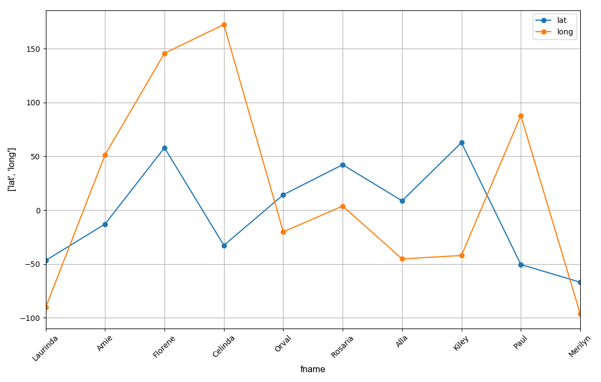
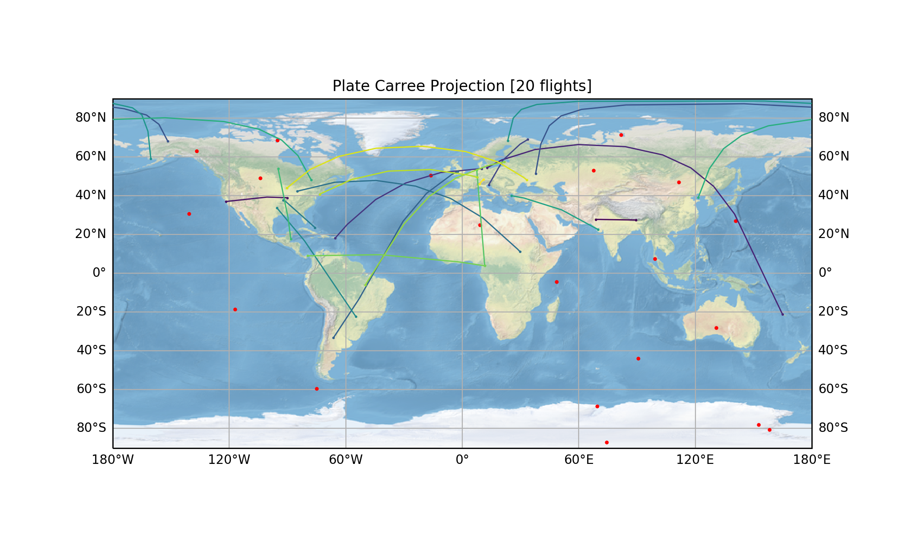
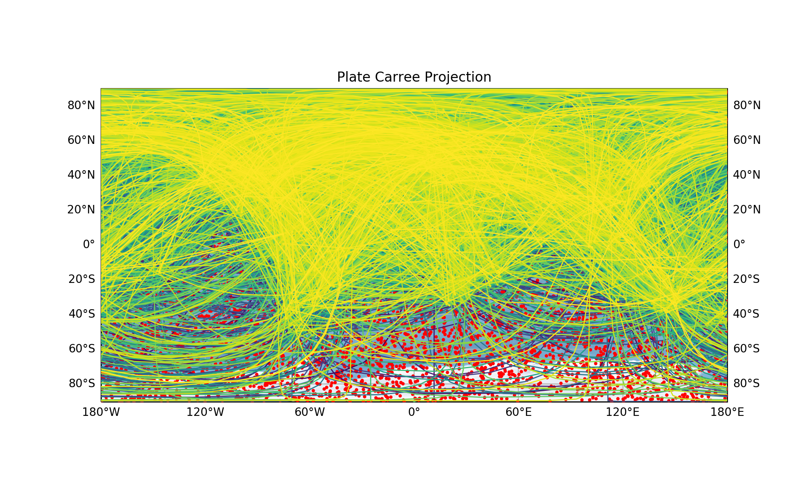
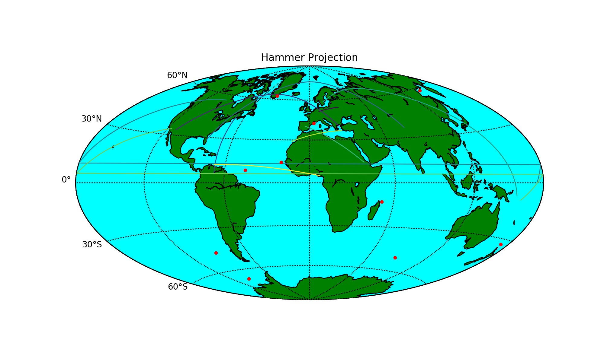

# Python Projects

**Table of Contents**

- [Current Tasks](#current-tasks)
- [Current Errors and Pressing Tasks](#current-errors-and-pressing-tasks)
- [Projects](#projects)
  - [Data Generator](#data-generator-dg)
- [Required Python Modules](#required-python-modules)
- [Running Scripts](#running-scripts)
  - [Data Generator Script](#data-generator-data_generator_script)
    - [Generated Data](#generated-data)
- [Deprecated Scripts](#deprecated-scripts)
- [Completed Tasks](#completed-tasks)
- [Resolved Errors](#resolved-errors)


# Current Tasks

- [ ] Set up and decide on modules for data generator


- [ ] Random data
  - [x] datetime (7/29/2017)
    - [x] UNIXTime (7/29/2017)
    - [ ] Julian Day
    - [x] Day of year (7/30/2017)
    - [ ] Different date sequence Y-D-M
  - [x] names (7/29/2017)
    - [x] load names from file (7/29/2017)
  - [x] emails (7/29/2017)
  - [x] payload (7/29/2017)
  - [x] latitude/longitude (7/29/2017)
    - [x] latitude/longitude checker (7/29/2017)
  - [ ] Add cityin and cityout
    - [ ] City name
    - [ ] City coordinates
        

- [ ] Input statements
  - [ ] Format of data
      - [ ] Output datetime column in various formats
  - [x] Different delimiters (i.e ;/,/./*&/%!) (7/31/2017)


- [ ] Statements to break script
  - [ ] Inputs that will trigger errors

- [ ] Data corruption generator
  - [x] Percentage of the data frame (7/31/2017)
  - [x] Randomize corruption to entire dataframe (7/31/2017)
  - [x] Randomize corruption to a column (8/01/2017)
  - [ ] Randomize corruption to a row
  - [x] Replace values with nan (7/31/2017)
  - [ ] Replace values with -99999.0

- [ ] Plot data with matplotlib
  - [ ] Input scheme of all data columns
    - [x] fname : payload (8/17/2017)
    - [x] datetime : payload  (8/17/2017)
    - [ ] subplot with all preceding plots
  - [x] Make Hammer projection for latitude and longitude values (8/10/2017)
    - [x] Make points for the coordinates in the datafile (8/10/2017)
  - [x] Create a flight trajectory from cityin to cityout (8/15/2017)
    - [x] Fix trajectories on limb intersections (8/17/2017)
    - [x] Put a statement to make sure that the same airport can't be city_in/city_out (8/18/2017)


# Current Errors and Pressing Tasks

### Strange error when using large number of lines
- Recreate situation using [data_generator_noinput.py](https://github.com/byamashiro/Python_Projects/blob/master/data_generator.py) by using a total of 10000 lines. Possibility that there is a duplicate string even with the for loop to stop this interaction for 'Apt_ID_in' and 'Apt_ID_out'.  

```python
/Users/bryanyamashiro/Documents/Python_Projects/data_generator_noinput.py:210: SettingWithCopyWarning: 
A value is trying to be set on a copy of a slice from a DataFrame

See the caveats in the documentation: http://pandas.pydata.org/pandas-docs/stable/indexing.html#indexing-view-versus-copy
  dg_df['Apt_ID_out'][i] = np.random.choice(apt_data['Airport_ID'], int(no_lines))
---------------------------------------------------------------------------
KeyError                                  Traceback (most recent call last)
/Users/bryanyamashiro/miniconda3/envs/classUHenv/lib/python3.6/site-packages/pandas/core/series.py in _set_with_engine(self, key, value)
    777         try:
--> 778             self.index._engine.set_value(values, key, value)
    779             return

pandas/_libs/index.pyx in pandas._libs.index.IndexEngine.set_value (pandas/_libs/index.c:4649)()

pandas/_libs/index.pyx in pandas._libs.index.IndexEngine.set_value (pandas/_libs/index.c:4475)()

pandas/_libs/index.pyx in pandas._libs.index.DatetimeEngine.get_loc (pandas/_libs/index.c:9756)()

pandas/_libs/index.pyx in pandas._libs.index.IndexEngine._get_loc_duplicates (pandas/_libs/index.c:5394)()

KeyError: 9049

During handling of the above exception, another exception occurred:

...

ValueError                                Traceback (most recent call last)
/Users/bryanyamashiro/Documents/Python_Projects/data_generator_noinput.py in <module>()
    208         while True:
    209                 if dg_df['Apt_ID_out'][i] == dg_df['Apt_ID_in'][i]:
--> 210                         dg_df['Apt_ID_out'][i] = np.random.choice(apt_data['Airport_ID'], int(no_lines))
    211                 else:
    212                         break

/Users/bryanyamashiro/miniconda3/envs/classUHenv/lib/python3.6/site-packages/pandas/core/series.py in __setitem__(self, key, value)
    769         # do the setitem
    770         cacher_needs_updating = self._check_is_chained_assignment_possible()
--> 771         setitem(key, value)
    772         if cacher_needs_updating:
    773             self._maybe_update_cacher()

/Users/bryanyamashiro/miniconda3/envs/classUHenv/lib/python3.6/site-packages/pandas/core/series.py in setitem(key, value)
    726                         not self.index.inferred_type == 'integer'):
    727 
--> 728                     values[key] = value
    729                     return
    730                 elif key is Ellipsis:

ValueError: setting an array element with a sequence.

...

```

### CDF writer stopped working
- There is an index error that is stopping the write of each column. It was the case that there cannot be floats loaded into a column of CDF, but even int/float are being rejected  
```python
...The dtime column was not added to the output CDF file...```  
```IndexError: in the future, 0-d boolean arrays will be interpreted as a valid boolean index```  


### Plot script subplots
- Devise same subplot system from [pandas_test_omni.py](https://github.com/byamashiro/Research_Projects/blob/master/Scripts/pandas_test_omni.py).
- Change vertical spacing to account for different x-axis.


### Plot input sequence
- Implement a feature to skip initial plotting and skip to the projection plotting.
- Create an input sequence for plotting. If the user picks a string, only allow non-strings to be plot against. Have input if there will be multiple second axis rather than subplot features. Include hammer projection in the initial option.


### Corruption errors when parsing full dataframe
- When using the corruption for the full dataframe, the day of year and some unix_time timestamps do not correlate with the respective datetime index. 

# Projects

## Data Generator (DG)

Columns         |   DataFrame Column Name  | Format | Notes
------------    |   ------------ | ------------- | -------------
**names**       |   fname, lname  | random string |  Load from a file 'names.txt' and push into a list/set of full string.
**emails**      |   email_address | random string with @host.com | First initial of first name, followed by last name '@' host '.' com/edu/gov/etc.
**from ip**     |   fmip          | formatted sequence with '.' (i.e ##.###.###.###) | Sequence of integers separated by '.', usually in the format (##.###.###.###).
**to ip**       |   toip          | formatted sequence with '.' (i.e ##.###.###.###) | Sequence of integers separated by '.', usually in the format (##.###.###.###).
**latitude**    |   lat           | formatted float, 1-round from (0-360) | Formatted float followed by a decimal of latitude (-90 to 90 degrees) and longitude (-180 to 180).
**longitude**   |   long          | formatted float, 1-round from (0-360) | Formatted float followed by a decimal of latitude (-90 to 90 degrees) and longitude (-180 to 180).
**datetime**    |   date_time     | datetime | Common string yyyy-mm-dd hh:mm:ss.s and convert using datetime functions.
**payload**     |   payload       | random integer                | A random integer from 0-1000000.
**day of year** |   doy           | integer following datetime format    | Integer of a day with respect to a specified year
**unix time**   |   unix_time     | float following datetime format    |  Epoch time of number of seconds since January 1, 1970
**airport ID**   |   Apt_ID_in,Apt_ID_out     | random integer    |  A randomly chosen integer out of a list of integers that correspond to a specific airport
**country**     |   country_in,country_out | random string | Loaded random country string that represents a specific airport and airport ID.
**city**     |  city_in,city_out  | random string | Loaded random city string that represents a specific airport and airport ID.
**city latitude**     |  city_lat_in,city_lat_out  | formatted float | Loaded corresponding airport latitude with respect to the random airport ID
**city longitude**     |  city_long_in,city_long_out  | formatted float | Loaded corresponding airport longitude with respect to the random airport ID


#### Corruption
- Values that are 'bad' (i.e -99999, null, nan, -1E30)
- Push to random spots in column and whole DataFrame
- Set up extent of corruption (i.e harsh (70% of data), light (20% of data))


### Required Python Modules
Module       | Submodule(s) | as | Uses
------------ | ------------- | ------------- | -------------
**pandas**              | -                | pd          | DataFrames, indexing, plotting, downloading http url data, csv_reader()
**numpy**               | -                | np          | NaN values
**random**              | -                | -           | Randomizer for random colors
**matplotlib**          | .pyplot, .mdates, cm | plt, mdates | Plotting, subplots, date formatting, color map pool for 'rainbow' and 'viridis' schemes
**datetime**            | -                | -           | Datetime indexing, datetime strings, datetime conversion from strings
**sys**                 | -                | -           | Exiting script
**geopy.geocoders**     | Nominatim        | -           | Enables real-time verification of given latitudes and longitudes
**json**     | -        | -           | Allows for previewing data in .json format
**mpl_toolkits**     | Basemap        | -           | Allows for previewing data in .json format
**cartopy**     | cartopy.crs        | ccrs           | Module to plot Platte Carree projections and flight trajectories
**cartopy.mpl.gridliner**     |  LONGITUDE_FORMATTER, LATITUDE_FORMATTER       | -           | Enables formatting of latitudes and longitudes in (+/-) to more intuitive (N,S,E,W) degrees
~~**wget**~~                | -                | -           | Downloading files online (.cdf, .csv, .ascii, .txt)
~~**os**~~                  | -                | -           | Remove files through script
~~**spacepy**~~             | pycdf            | -           | Reading Common Data Format
~~**urllib**~~              | error            | -           | For HTTPError recognition


\* Strike through modules are currently not in use in the current version of the script, but will later be implemented.

# Running Scripts

## Data Generator ([data_generator_script](https://github.com/byamashiro/Python_Projects/blob/master/data_generator.py))
The script reads data from three external data files, located in the [data folder](https://github.com/byamashiro/Python_Projects/tree/master/data). Names are pulled from the [first](https://github.com/byamashiro/Python_Projects/blob/master/data/CSV_Database_of_First_Names.csv) and [last](https://github.com/byamashiro/Python_Projects/blob/master/data/CSV_Database_of_Last_Names.csv) name data files and randomly pushed into the respective name columns. The email address are generated with the first character of the first name, the full last name, and a randomly selected domain name from the [domain data file](https://github.com/byamashiro/Python_Projects/blob/master/data/free_email_provider_domains.txt).  

### Current lines-size estimations
Lines       | Time to generate [s] | File size [.csv] | Notes
------------ | ------------- | ------------- | -------------
10              | 0.13                | 3 KB          | Elapsed Time: 0.13 seconds ```CDF Reader is currently not functional.```
100              | 0.18                | 25 KB          | Elapsed Time: 0.18 seconds ```CDF Reader is currently not functional.```
1000              | 0.73                | 244 KB          | Elapsed Time: 0.73 seconds ```CDF Reader is currently not functional.```
10000               | 5.4                | 2.4 MB          | Elapsed Time: 5.4 seconds ```CDF Reader is currently not functional.```


In [180]: **run data_generator.py**  
\========================================  
\=            Data Generator            =  
\========================================  
Enter desired number of lines: 17  
[x] Data Frame Generated.  
[x] Names generated.  
Enter a start date (yyyymmdd): 20110809  
Enter an end date (yyyymmdd): 20120307  
Enter a start hour (hh): 01  
Enter an end hour (hh): 14  
[x] Dates generated.  
[x] Email addresses generated.  
[x] IP Addresses generated.  
Check Latitude and Longitude (yes or no) - use "no" for time saving: no  
[x] Latitude and longitude generated.  
[x] Payload generated.  
\========================================  
\=          Corruption Options          =  
\========================================  
fname  
lname  
unix_time  
doy  
email_address  
toip  
fmip  
lat  
long  
payload  
\========================================  
Enter Corruption Option(s) then "done" or "all" or "none": all  
Enter amount of corruption (0-100%): 20  
[x] Full dataframe corruption for 34/170 data values generated.  
\========================================  
\=            Output Options            =  
\========================================  
1 - CSV  
2 - ASCII  
3 - JSON  
4 - PKL  
5 - SQL  
\========================================  
Enter Output Option(s) then "done" or "none": all  
Choose delimiter character for .csv output: ,  
[x] Output as CSV generated.  
[x] Output as TXT generated.  
[x] Output as JSON generated.  
[x] Output as PKL generated.  
[x] Output as SQL generated.  


## Data Plotter ([data_plotter_script](https://github.com/byamashiro/Python_Projects/blob/master/plot_data.py))
In [3]: **run plot_data.py**  
This unreleased version of SpacePy is not supported by the SpacePy team.  
\========================================  
\=                  X                   =  
\========================================  
1. fname  (Only available for x-axis)  
2. lname  (Only available for x-axis)  
3. dtime  (Only available for x-axis)  
4. unix_time  
5. doy  
6. email_address  (Only available for x-axis)  
7. toip  (Only available for x-axis)  
8. fmip  (Only available for x-axis)  
9. lat  
10. long  
11. payload  
12. Apt_ID_in  
13. country_in  (Only available for x-axis)  
14. capital_in  (Only available for x-axis)  
15. city_lat_in  
16. city_long_in  
17. Apt_ID_out  
18. country_out  (Only available for x-axis)  
19. capital_out  (Only available for x-axis)  
20. city_lat_out  
21. city_long_out  
\========================================  
Choose x-axis data: fname  
  
\========================================  
\=                  Y                   =  
\========================================  
1. unix_time  
2. doy  
3. lat  
4. long  
5. payload  
6. Apt_ID_in  
7. city_lat_in  
8. city_long_in  
9. Apt_ID_out  
10. city_lat_out  
11. city_long_out  
\========================================  
Enter y-axis data then "done" or "all": lat  
Enter y-axis data then "done" or "all": long  
Enter y-axis data then "done" or "all": done  
Plot latitude and longitude projection? (yes or no): yes  







#### Deprecated basemap module projection



### Generated Data
#### Sample Generated DataFrame
```
In [39]: dg_df.head(3)  
Out[39]:   
    fname    lname           date_time      unix_time  doy  \  
0   Vonda  Bossart 2011-03-14 11:06:23 1300136783.000    3     
1    Sade    Polan 2011-04-02 19:13:04 1301807584.000   73     
2  Leatha    Haran 2011-04-03 14:29:16 1301876956.000   92     
  
             email_address           toip            fmip     lat     long  \  
0  VBossart@mail2chuck.com   78.69.169.59  168.163.120.28 -50.800 -158.216     
1        SPolan@timein.net  230.19.28.105    240.53.187.8 -77.462  -75.204     
2  LHaran@mail2liberia.com  27.107.202.74  13.218.216.247 -64.363  168.564     
  
   payload    
0   181288    
1   437522    
2   334732   
```

fname | lname | date_time | unix_time | doy | email_address | toip |  fmip |  lat | long |  payload
---- | ---- | ---- | ---- | ---- | ---- | ---- | ---- | ---- | ---- | ----
Vonda  | Bossart | 3/14/11 11:06 | 1300136783 | 3  |   VBossart@mail2chuck.com | 78.69.169.59   | 168.163.120.28 | -50.80011  | -158.215686 | 181288
Sade   | Polan   | 4/2/11 19:13  | 1301807584 | 73 |   SPolan@timein.net       | 230.19.28.105  | 240.53.187.8   | -77.46244  | -75.203543  | 437522
Leatha | Haran   | 4/3/11 14:29  | 1301876956 | 92 |   LHaran@mail2liberia.com | 27.107.202.74  | 13.218.216.247 | -64.362629 | 168.564349  | 334732


#### Sample Corrupted DataFrame
```
In [182]: dg_df.head(3)  
Out[182]:   
                       fname    lname      unix_time    doy  \  
date_time                                                       
2011-08-27 02:20:18    Kesha      NaN 1314447618.000 11.000     
2011-09-17 07:34:58   Verdie     Poma 1316280898.000 15.000     
2011-09-26 04:52:48  Maritza  Dacunto 1317048768.000 15.000     

                          email_address            toip            fmip  \  
date_time                                                                   
2011-08-27 02:20:18   KSplane@inwind.it  110.100.100.11             NaN     
2011-09-17 07:34:58  VPoma@mail2ron.com  118.16.185.205  213.221.43.205     
2011-09-26 04:52:48                 NaN  152.237.79.112   34.56.181.141     
  
                        lat    long    payload    
date_time                                         
2011-08-27 02:20:18     nan 128.928 280795.000    
2011-09-17 07:34:58     nan 148.523 615548.000    
2011-09-26 04:52:48 -25.044     nan 755488.000   
```

date_time     | fname     | lname       | unix_time  | doy  | email_address             | toip           | fmip           | lat         | long       | payload
---- | ---- | ---- | ---- | ---- | ---- | ---- | ---- | ---- | ---- | ----
8/14/11 4:01  | Terrilyn  | Kruszewski  | nan        | 8    | TKruszewski@naz.com       | 255.6.237.201  | 76.228.98.103  | -55.022669  | nan        | 744910
8/24/11 15:00 | Barton    | Giggey      | 1314234025 | nan  | nan                       | 215.33.124.43  | 7.187.108.26   | 37.999557   | 117.828386 | nan
8/31/11 20:55 | Dewey     | Hellings    | 1314860105 | nan  | DHellings@emailpinoy.com  | 44.178.193.124 |-24.310369      | 89.248527   | nan        | 208362


##### .csv output
```
fname,lname,date_time,unix_time,doy,email_address,toip,fmip,lat,long,payload  
Vonda,Bossart,2011-03-14 11:06:23,1300136783.0,3,VBossart@mail2chuck.com,78.69.169.59,168.163.120.28,-50.80011,-158.215686,181288  
Sade,Polan,2011-04-02 19:13:04,1301807584.0,73,SPolan@timein.net,230.19.28.105,240.53.187.8,-77.46244,-75.203543,437522  
Leatha,Haran,2011-04-03 14:29:16,1301876956.0,92,LHaran@mail2liberia.com,27.107.202.74,13.218.216.247,-64.362629,168.564349,334732  
...
```

##### .txt output
```
fname lname date_time unix_time doy email_address toip  fmip  lat long  payload  
Vonda Bossart 2011-03-14 11:06:23 1300136783.0  3 VBossart@mail2chuck.com 78.69.169.59  168.163.120.28  -50.80011 -158.215686 181288  
Sade  Polan 2011-04-02 19:13:04 1301807584.0  73  SPolan@timein.net 230.19.28.105 240.53.187.8  -77.46244 -75.203543  437522  
Leatha  Haran 2011-04-03 14:29:16 1301876956.0  92  LHaran@mail2liberia.com 27.107.202.74 13.218.216.247  -64.362629  168.564349  334732  
...
```


# Deprecated Scripts
Deprecated [scripts](https://github.com/byamashiro/Python_Projects/tree/master/deprecated_scripts) are kept for reference with comments. All scripts are working, but most do not incorporate changes in future versions.

# Completed Tasks

- [x] Push data into pandas DataFrame (8/02/2017)
  - [x] Output data in different formats (8/02/2017)
      - [x] JSON (7/31/2017)
      - [ ] ~~xml~~ (removed due to write issues)
      - [x] pickle (7/31/2017)
      - [x] csv (7/29/2017)
      - [x] cdf (8/02/2017)
      - [x] ascii (delimited by a tab) (7/31/2017)
      - [x] sql (7/31/2017)


# Resolved Errors

### Remake projection with the 'cartopy' module (8/17/2017)
* **Resolution**: The cartopy module allowed for plotting with the Platte Carree projection. Issues with limb interaction were correctly fixed with cartopy. Minor aesthetic problems occur when using the great circle, where the trajectories are not smooth (possible correction using 'spline' or increasing sample size (GNUplot solution)).
- The basemap module is now deprecated and will be ended with python 2.7. In this case, the 'cartopy' module will be used in place of basemap. Problems of basemap will be merged with this task since the cartopy module rectifies the basemap plot limitation for great circles.
- The basemap module runs into a few complications when a trajectory intersects the projection limb. Instead of a trajectory resuming on the other limb, a horizontal line is generated from one limb to the other, and then the trajectory is resumed.


### Cityin and Cityout data columns (8/15/2017)
* **Resolution**: New airport data was used to accurately represent specified airports and the respective cities and countries. Instead of parsing off of countries like the previous code, the 'Airport_ID' was used. This was because the IDs are unique integer values, whereas there could be multiple representations of countries.
- Current implementation uses capital cities worldwide, but the problem lies in the excessive amount of cities in Africa. When using the flight map, the code will show most flights trajectories tracing to Africa. Airport latitude and longitudes will be implemented for airports rather than cities to accurately represent flight trajectories.
- Add cities that have international airports. As the toip and fmip, there will be a pair of two cities. Eventually plots will be generated with trajectories from the cityin to cityout.

### Issues with data (8/13/2017)
* **Resolution**: The 'sorted' function was applied to the list containing the day of year (i.e. sorted(doy_list)). In this instance, the sorted feature was removed and the doy is represented correctly.
- The sort option is exhibiting strange behavior. Each column, or some of them, are being sorted. For example, the 'doy' column is sorting itself in numerical order (i.e 1-365).

### Adding corruption (8/01/2017)
* **Resolution**: Instead of two different corruption segments for the entire dataframe and column-wise, both were integrated into one loop.
- Specific amount of corruption will be specified with an input statement. A total amount of elements within the frame will be calculated and a random percentage will be replaced with corrupted values. Functions should include 1) find number of elements, 2) randomize element location/index, 3) find and replace element values.

### Output to SQL (7/31/2017)
* **Resolution**: Connection was created, and the data was saved to a sql database (.db) file.
- Create a connection and execute procedures from the pandas dataframe to sql. The function from the dataframe will be .to_sql, but requires a connection method. Just specifying an output name does not suffice as in the .to_csv function.  
```TypeError: to_sql() missing 1 required positional argument: 'con'```

